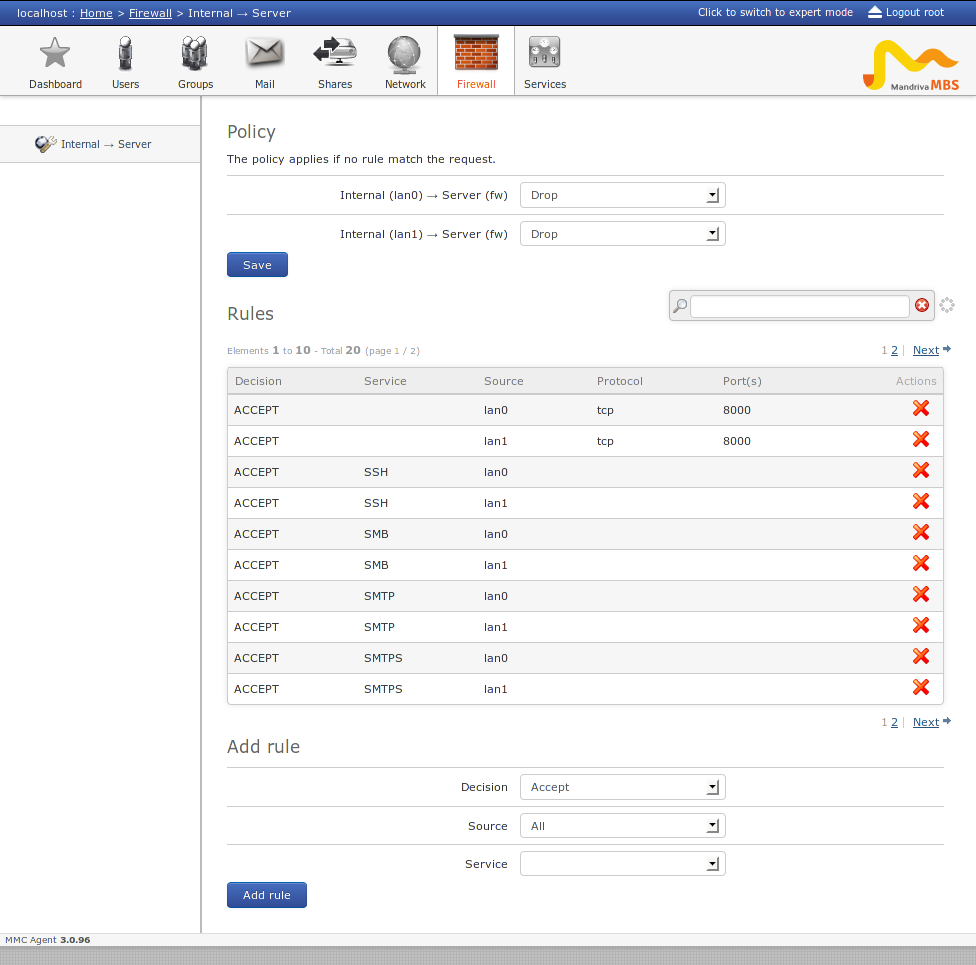

================
Shorewall plugin
================

Installation
============

Install the packages ``python-mmc-shorewall`` and ``mmc-web-shorewall``.

MMC « shorewall » plugin
========================

THe shorewall plugin will manage the files in ``/etc/shorewall``. The plugin is
designed to manage internal and external interfaces. An external interface is
generally connected to an insecure network (Internet), and internal interface
is connected to a known/controlled network.

Typically if your server is installed in a datacenter and have a public
interfaces to the Internet, they are external interfaces. If your server is in
your local network you have only internal interfaces. A server acting as
a gateway has generally one public interface and one interface interface.

Once your interfaces are defined as 'internal' or 'external' all the firewall
configuration can be done from the MMC interface. Depending on your interfaces
configuration you will be able to access more or less features. For example, if
you have one internal and one external interface you will be able to create
a NAT rule for your internal network.

Example of the shorewall plugin with two 'internal' interfaces:

MMC « shorewall » plugin configuration
======================================

Like every MMC plugin the configuration can be found in
``/etc/mmc/plugins/shorewall.ini``

The plugin will assume that an interface is internal or external because of its
zone name. By default if your zone begins by 'lan' (lan0, lanA ...) the
interface will be considered as 'internal'. If the zone name begins by 'wan',
the interface is considered as 'external'.

You can change theses names by changing the ``external_zones_names`` and
``internal_zones_names`` options.

Shorewall configuration
=======================

The initial shorewall configuration should be done manually. Check the
shorewall docs for more information about shorewall configuratioon.

Example with a gateway (two interfaces, one internal, one external).

In ``/etc/shorewall/interfaces`` declare your network interfaces and associated
zones:

::

    lan0     eth0
    wan0     eth1

In ``/etc/shorewall/zones`` declare your zones types:

::

    fw      firewall
    lan0    ipv4
    wan0    ipv4

In ``/etc/shorewall/policy`` define the default policy between your zones:

::

    fw      all     ACCEPT  # server -> anywhere
    lan0    fw      DROP    # lan0 -> server
    wan0    fw      DROP    # wan0 -> server
    all     all     DROP    # catch-all rule

Finally, be sure that the file ``/etc/shorewall/rules`` exists
