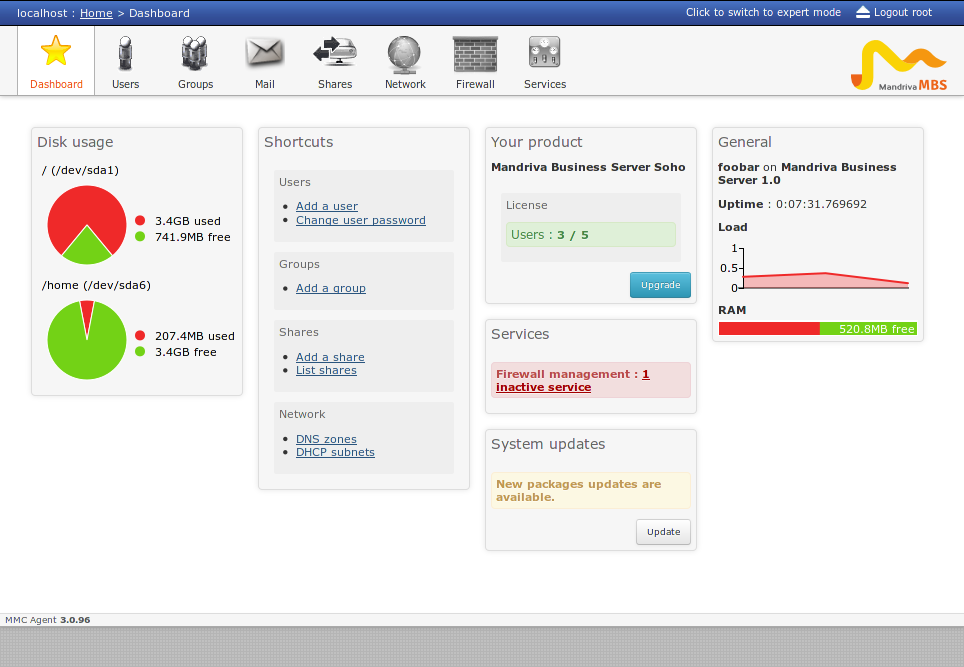

================
Dashboard plugin
================

.. note:: The configuration of the dashboard plugin is optionnal

Installation
============

Install the packages ``python-mmc-dashboard`` and ``mmc-web-dashboard``.
Restart the ``mmc-agent`` service.

MMC « dashboard » plugin
========================

The dashboard plugin will replace the legacy MMC-CORE home page with
a page that can display panels from different MMC plugins.

Every MMC plugin can register its panels to the dashboard.

Example of the the MBS SOHO dashboard:

MMC « dashboard » plugin configuration
======================================

Like every MMC plugin the configuration can be found in
``/etc/mmc/plugins/dashboard.ini``

The ``disabled_panels`` option can contain a list of panels that will be
disabled. For example, to disable the shortcut and general panel:

::

    disabled_panels = shortcut general
